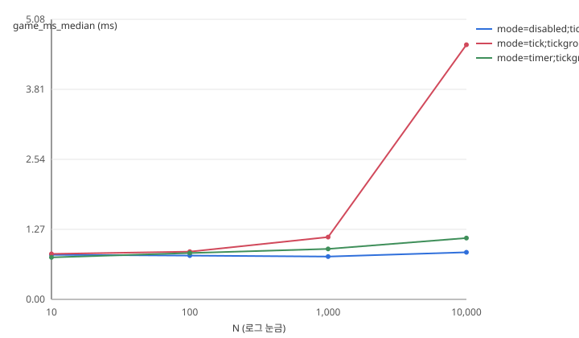

# 10 — 합성 층 결과

작성 기준일 2026-08-23 · 엔진 Unreal Engine 5.8.1

합성 층 항목(M1·M3·M5·M6·M7·M8)의 실측 결과를 모은다.
근거는 `results/<machine-id>/<날짜>/` 의 원시 데이터이고, 이 문서에는 거기서 읽어낸 것만 적는다.
측정하지 않은 축은 측정하지 않았다고 쓴다.

> **현재 상태 — M1 2차 측정 완료.** N≥1,000 구간의 수치를 쓴다.
> 1차(같은 날짜)는 프로토콜 결함으로 폐기했고 경위는 부록에 남겼다.
> 원시 데이터는 `results/_discarded/desktop-13900kf/2026-08-23-attempt1/` 에 보존돼 있다.

---

## 측정 환경

| 항목 | 값 |
|---|---|
| machine_id | `desktop-13900kf` |
| CPU | 13th Gen Intel Core i9-13900KF (물리 24 · 논리 32) |
| 코어 고정 | `FFFF` — P코어 논리 0–15. E코어(16–31)는 쓰지 않는다 |
| GPU | NVIDIA GeForce RTX 4060 Ti |
| RAM | 128 GB |
| OS | Windows 11 build 26200 |
| 엔진 | `5.8.1-56057345+++UE5+Release-5.8` (런처 바이너리) |
| 빌드 구성 | Development |
| RHI | D3D12 (SM6) |
| Substrate | 끔 |
| 스케일러빌리티 | 전 항목 3 |

워밍업 3.002초 · 측정 10.001초 · 반복 5회(프로세스 재시작 단위) · `-benchmark` 고정 타임스텝.

### `-nullrhi` 를 쓰지 않은 이유

프로토콜은 CPU 항목에 `--rhi auto`(즉 `-nullrhi`)를 기본으로 둔다. 이번 측정은 `--rhi real` 로 돌렸다.
같은 조건(N=1,000 · tick · 코어 고정)을 RHI 만 바꿔 재본 결과다.

| | `--rhi null` | `--rhi real` |
|---|---|---|
| fps | 1,516 | 734 |
| frame_ms | 0.6084 | 1.2976 |
| **game_ms** | **0.0000** | 1.1866 |
| render_ms | 0.0000 | 1.0976 |
| render_bound | false | **false** |

`GGameThreadTime` · `GRenderThreadTime` · `RHIGetGPUFrameCycles()` 는 모두 `FViewport::Draw` 에서
갱신된다(`RenderTimer.h` 주석에 명시). `-nullrhi` 면 그 경로가 돌지 않아 세 값이 0으로 남는다.
게임 스레드 시간이 대상인 항목에서 `-nullrhi` 를 쓰면 잴 대상이 사라진다.

1차에서 렌더 바운드로 보였던 것(render 1.265 ≈ frame 1.275)은 측정 창이 0.9초였던 탓이 크다.
창을 10초로 고치자 `render_bound=false` 가 됐고 게임 스레드가 렌더 스레드보다 커졌다.
`-nullrhi` 를 붙일 근거가 이 항목에서는 사라진 셈이다.

**미해결** — 러너가 게임 스레드 시간을 엔진 전역이 아니라 직접 재면 `-nullrhi` 와 `game_ms` 를
둘 다 가질 수 있다. 아직 하지 않았다.

---

## M1. Tick vs Timer vs 이벤트 구동

**통설** — Tick을 쓰지 마라

**방법** — 액터 N개를 스폰하고 세 조건으로 돌린다. 빈 `TickComponent` / `TimerManager` 0.1초 주기 /
Tick 비활성. Tick Group은 `TG_PrePhysics` 고정.

### 노이즈 바닥

`disabled` 는 N과 무관하게 액터당 작업이 0이다. 이 조건 20회의 산포가 곧 측정 하한이다.

| | 1차 (창 0.9초 · 코어 고정 없음) | 2차 (창 10초 · P코어 고정) |
|---|---|---|
| 중앙값 | 0.7995 ms | 0.8285 ms |
| 산포 | 0.1620 ms | **0.0837 ms** |
| 표준편차 | 0.0418 ms | **0.0195 ms** |

산포와 표준편차가 모두 절반 이하로 줄었다. 다만 **측정 창과 코어 고정을 한 번에 바꿨으므로
어느 쪽이 얼마나 기여했는지는 이 데이터로 가르지 못한다.**

`disabled` 가 N에 따라 흔들리던 것도 잦아들었다. 1차는 0.766–0.896 이었고 2차는 0.812–0.844 다.
변할 이유가 없는 값이 안 변하게 됐다는 뜻이다.

### 결과 — 게임 스레드 시간 (ms)



절대값이다. 괄호 없는 값이 곧 `game_ms` 중앙값이다.

| 조건 | N=10 | N=100 | N=1,000 | N=10,000 |
|---|---|---|---|---|
| `disabled` | 0.8315 | 0.8444 | 0.8232 | 0.8125 |
| `tick` | 0.8344 | 0.8753 | 1.2158 | 4.3596 |
| `timer` | 0.7896 | 0.8229 | 0.8695 | 1.0535 |

같은 N의 `disabled` 를 뺀 순증분으로 보면 이렇다. 노이즈 바닥 0.0837 ms 와 함께 읽는다.

| 조건 | N=10 | N=100 | N=1,000 | N=10,000 |
|---|---|---|---|---|
| `tick` | +0.0029 (신호 없음) | +0.0309 (신호 없음) | **+0.3926** (4.7배) | **+3.5471** (42.4배) |
| `timer` | −0.0419 (신호 없음) | −0.0215 (신호 없음) | +0.0463 (신호 없음) | **+0.2410** (2.9배) |

괄호는 노이즈 바닥 대비 배수다. 1배 미만이면 잡음과 구별되지 않는다.
`timer` 의 N=10·100 이 음수인 것이 그 증거다. 비용이 음수일 리 없다.

### 읽어낸 것

**N=10과 N=100에서는 Tick을 켜고 끄는 차이가 이 장비로 측정되지 않는다.**
N=10의 순증분 +0.0029 ms는 노이즈 바닥의 1/29다. "Tick을 쓰지 마라"가 액터 열 개짜리 상황을
가리킨다면 근거가 없다.

**비용은 등록된 Tick 함수 수에 선형으로 붙는다.** 유의 구간 두 점의 액터 1,000개당 비용이다.

| | N=1,000 | N=10,000 |
|---|---|---|
| `tick` | 0.3926 ms | 0.3547 ms |
| `timer` | 0.0463 ms | 0.0241 ms |

`tick` 은 N을 10배 늘려도 액터당 단가가 0.3926 → 0.3547 로 거의 같다. Tick이라는 기능에 붙는
고정 비용이 아니라 **등록 수에 비례하는 구조**라는 뜻이다. 가설과 맞는다.

### 중앙값만 보면 결론이 뒤집힌다

여기가 이번 측정에서 가장 중요한 부분이다. 같은 데이터를 P95로 다시 보면 그림이 달라진다.

| N | `tick` 중앙 | `tick` P95 | `timer` 중앙 | `timer` P95 | 중앙 기준 배수 | P95 기준 배수 |
|---|---|---|---|---|---|---|
| 1,000 | +0.3926 | +0.5137 | +0.0463 | +0.1592 | 8.5배 | 3.2배 |
| 10,000 | +3.5471 | +3.8733 | +0.2410 | **+4.2215** | 14.7배 | **0.9배** |

**N=10,000에서 중앙값은 Timer가 14.7배 싸다고 말하고, P95는 오히려 Timer가 근소하게 비싸다고
말한다.** 프레임 시간 분포를 보면 이유가 분명하다.

```
N=10,000 timer  (4,239 프레임, 중앙 1.19ms)      N=10,000 tick (2,285 프레임, 중앙 4.35ms)
  0.53–1.48ms  ██████████████  62.7%              3.95–4.60ms  ████████████████  84.1%
  1.48–3.85ms  ██               3.9%              그 외              집중, 단봉
  3.85–6.22ms  ███████         32.3%
  중앙*1.5 초과 33.9%                              중앙*1.5 초과 0.1%
```

`timer` 는 **이봉 분포**다. 3분의 2는 타이머가 안 터지는 싼 프레임이고, 3분의 1은 배치로 터지는
4–6 ms 프레임이다. 중앙값이 싼 봉우리에 앉아 비용을 통째로 숨긴다.
`tick` 은 4.35 ms에 단봉으로 모여 있어 중앙값이 분포를 대표한다.

히치 비율(중앙값의 1.5배를 넘는 프레임)이 이걸 그대로 보여준다.

| | N=10 | N=100 | N=1,000 | N=10,000 |
|---|---|---|---|---|
| `disabled` | 1.33% | 0.54% | 2.01% | 1.34% |
| `tick` | 2.20% | 1.46% | 1.30% | **0.09%** |
| `timer` | 1.23% | 1.68% | 1.33% | **33.83%** |

N=10,000에서 `tick` 은 0.09%로 가장 고른 반면 `timer` 는 33.83%다. 5회 반복 전부 33.6–33.9%로
나왔으니 우연이 아니라 계통적인 현상이다.

원인은 시나리오 코드에서 보인다. 액터마다 스폰 시점에 같은 주기로 타이머를 건다.

```cpp
GetWorldTimerManager().SetTimer(
    TimerHandle, this, &ABenchDummyActor::OnTimer, 0.1f, /*bLoop=*/true);
```

10,000개가 같은 `Setup` 안에서 만들어지니 만기 시점이 거의 정렬되고, 한꺼번에 몰려서 터진다.

**그래서 "Tick 대신 Timer를 써라"는 조언은 절반만 맞는다.** 프레임당 평균 부하는 확실히 준다.
대신 부하가 특정 프레임에 뭉친다. 플레이어가 느끼는 것은 중앙값이 아니라 튀는 프레임이므로,
이 구성에서는 Timer로 바꿔서 체감이 나아진다고 말할 수 없다.

이 프로젝트가 평균 대신 중앙값과 P95를 쓰기로 한 이유가 여기서 실제로 드러났다.
중앙값 하나만 봤으면 정반대 결론을 냈을 것이다.

**주의** — 이 결론은 "모든 타이머가 같은 주기로 정렬돼 있을 때"에 한한다.
주기를 흩뿌리면(생성 시 랜덤 오프셋) 배치가 풀릴 가능성이 높다. 그 축은 아직 재지 않았다.

### 측정하지 않은 축

- **Tick Group.** `TG_DuringPhysics` · `TG_PostPhysics` 는 돌리지 않았다. `TG_PrePhysics` 하나뿐이다.
  "Tick Group은 비용이 아니라 실행 시점을 정한다"는 주장은 검증되지 않았다
- **타이머 위상 분산.** 위의 이봉 분포가 정렬 때문인지 확인하려면 랜덤 오프셋 조건이 필요하다
- **Shipping 구성.** Development만 쟀다
- **`FTickTaskManager` 스코프.** Tick 등록분이 매 프레임 전부 순회되는지는 Insights로 봐야 한다

---

## 게이트 판정 — 새 기준도 노이즈 바닥 아래다

프로토콜을 고치면서 판정 기준이 "반복 산포가 상대 5% 초과"에서 **"순증분의 10% 초과"** 로 바뀌었다.
신호 크기를 반영하므로 방향은 맞다. 그런데 같은 문제가 자리만 옮겨 남았다.

| N | mode | 순증분 | 게이트(10%) | 반복 산포 | 판정 |
|---|---|---|---|---|---|
| 10 | tick | +0.0029 | 0.0003 | 0.0927 | 신호 없음 |
| 10 | timer | −0.0419 | 0.0042 | 0.0573 | 편차 큼 |
| 100 | tick | +0.0309 | 0.0031 | 0.0345 | 편차 큼 |
| 100 | timer | −0.0215 | 0.0022 | 0.0879 | 편차 큼 |
| 1,000 | tick | +0.3926 | 0.0393 | 0.0859 | 편차 큼 |
| 1,000 | timer | +0.0463 | 0.0046 | 0.0954 | 편차 큼 |
| 10,000 | tick | +3.5471 | 0.3547 | 0.0794 | **OK** |
| 10,000 | timer | +0.2410 | 0.0241 | 0.0436 | 편차 큼 |

노이즈 바닥이 0.0837 ms인데 게이트가 그보다 좁은 조합이 8개 중 6개다.
`tick` N=1,000 이 대표적이다. 순증분 +0.3926 은 노이즈의 4.7배로 분명한 신호인데,
반복 산포 0.0859 가 게이트 0.0393 을 넘겨 "편차 큼" 으로 걸린다. 그런데 그 0.0859 는
사실상 노이즈 바닥 그 자체다. 측정이 나쁜 게 아니라 기준이 잴 수 없는 정밀도를 요구한다.

### 미해결 — 절대 하한 도입 여부

1차 때와 같은 제안이 그대로 유효하다.

> 반복 산포가 `max(순증분의 10%, 노이즈 바닥)` 을 넘으면 무효로 본다.
> 노이즈 바닥은 같은 스윕의 대조군 산포로 매번 측정해 `env.json` 에 남긴다.

이 기준을 적용하면 `tick` N=10,000 은 통과하고, `tick` N=1,000 은 0.0859 대 0.0837 로
아슬아슬하게 걸린다. 노이즈 한계에 놓인 측정이라는 뜻이니 그 판정 자체는 정직하다.

**아직 적용하지 않았다.** 프로토콜은 확정된 계약이므로 이 문서의 표는 현행 기준에서
경고가 붙은 상태 그대로 둔다.

---
## M3 · M5 · M6 · M7 · M8

아직 측정하지 않았다.

---

## 부록 — 1차 시도 (2026-08-23) — 폐기

측정 자체는 끝까지 돌았다. 60회 실행, 결과 파일도 다 나왔다.
그런데 숫자를 쓸 수 없었다. 원인이 네 개 겹쳐 있었다.

### 측정 창이 1초도 안 됐다

워밍업 120프레임, 측정 600프레임으로 정해뒀는데 이건 60fps 를 암묵적으로 가정한 값이다.
2초 워밍업에 10초 측정을 의도했다. 실제로는 `t.MaxFPS 0` 에 빈 맵이라 780fps 로 돌았다.

| | 의도 | 실제 |
|---|---|---|
| 워밍업 | 2초 | 0.15초 |
| 측정 | 10초 | 0.9초 |

조건마다 창 길이도 달랐다. `disabled` 는 0.9초, `tick N=10000` 은 2.9초였다.
같은 프레임 수가 서로 다른 측정 시간을 뜻하니 조건 간 비교 자체가 성립하지 않는다.

런 안에서 값이 흘렀다. 같은 조건인데 한 실행은 구간별 중앙값이
0.740 → 0.733 → 0.842 → 0.864 로 오르고, 다른 실행은 0.910 → 0.910 → 0.882 → 0.777 로
내려갔다. CPU 부스트 클럭이 자리 잡기 전에 측정이 끝나버린 것이다.

### 프레임이 렌더 스레드에 묶여 있었다

```
frame_ms  1.275
render_ms 1.265   ← frame_ms 와 같다
game_ms   0.804
gpu_ms    0.353
```

빈 맵인데 렌더 스레드가 1.27ms 를 썼다. GPU 가 0.35ms 니 렌더 스레드 CPU 작업이다.
M1 은 `-nullrhi` 를 써도 되는 항목인데 쓰지 않았다.

### 신호가 베이스라인에 묻혔다

N=10000 기울기로 역산하면 액터당 약 0.00038ms 다. N=10 이면 0.004ms.
베이스라인은 0.80ms 이고 잡음이 ±0.07ms 였다. 0.004ms 를 0.07ms 잡음 위에서 보려 한 셈이다.

아무것도 하지 않는 `disabled` 조건이 N 에 따라 0.855 → 0.766 → 0.896 으로 오르내린 것이
증거다. 변할 이유가 없는 값이 변했다.

### 판정 기준이 거꾸로 작동했다

절대 편차는 조건과 무관하게 ±0.07~0.2ms 로 거의 일정한데 상대 5% 기준을 썼다.
그래서 신호가 클수록 통과하고 작을수록 걸렸다.

| 조합 | 절대 편차 | 상대 | 판정 |
|---|---|---|---|
| `tick N=10000` | 0.199ms | 4.3% | 통과 |
| `disabled N=10` | 0.068ms | 8.4% | 경고 |

편차가 세 배 작은 쪽이 경고를 받았다.

### 그래서 무엇을 바꿨나

| 문제 | 조치 |
|---|---|
| 프레임 수로 자름 | `-warmupsec` / `-measuresec` 로 시간 기준 전환 (3초 / 10초) |
| 렌더 바운드 | CPU 항목은 `--rhi auto` 가 `-nullrhi` 를 자동으로 붙임 |
| 베이스라인이 신호를 덮음 | 같은 N 의 대조군을 뺀 순증분으로 보고, 여러 점이면 기울기도 함께 |
| 판정 기준 | 순증분 대비 편차로 변경, 신호가 0.02ms 미만이면 "신호 없음" 으로 표시 |
| 코어 마이그레이션 의심 | `--affinity` 로 P코어 고정, 적용값을 `env.json` 에 기록 |
| 문제를 늦게 발견 | 러너가 측정 창·히치·렌더 바운드·샘플 수를 스스로 판정해 `[quality]` 로 경고 |

### 1차 데이터를 새 기준으로 다시 읽으면

원시 데이터는 `results/_discarded/desktop-13900kf/2026-08-23-attempt1/` 로 옮겨 보존했다.
재측정이 같은 날짜에 이뤄지면 `results/<machine-id>/<날짜>/` 를 덮어쓰기 때문이고,
`parse_results.py` 가 `rglob` 로 재귀 순회하므로 같은 머신 트리 안에 두면 폐기본이
유효 데이터에 섞인다. machine_id 가 같아 혼입 검사에도 걸리지 않는다.
새 리포트 생성기로 다시 돌리면 12개 조합 중 신뢰할 수 있는 것은 하나뿐이다.

| 조건 | N=10 | N=100 | N=1,000 | N=10,000 | 액터 1,000개당 |
|---|---|---|---|---|---|
| `disabled` | (0.810) | (0.795) | (0.777) | (0.855) | — |
| `tick` | · | 0.071 ⚠ | 0.353 ⚠ | 3.767 | ~0.377 |
| `timer` | · | 0.047 ⚠ | 0.139 ⚠ | 0.259 ⚠ | — |

`·` 는 신호 없음, ⚠ 는 편차가 순증분의 10% 초과. 값이 그렇다는 뜻이 아니라
그 지점에서 측정이 성립하지 않았다는 뜻이다.

살아남은 `tick N=10000` 하나만 놓고 조심스럽게 말하면 빈 Tick 액터 1,000개가
게임 스레드에서 약 0.38ms 를 썼다. 다만 점 하나짜리 추정이고 측정 창이 2.9초에 불과했으므로
**확정 수치로 인용하지 않는다.** 재측정 뒤에 갱신한다.

---
